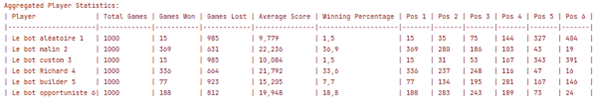
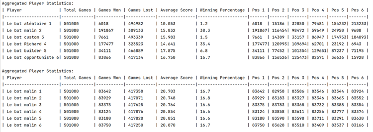
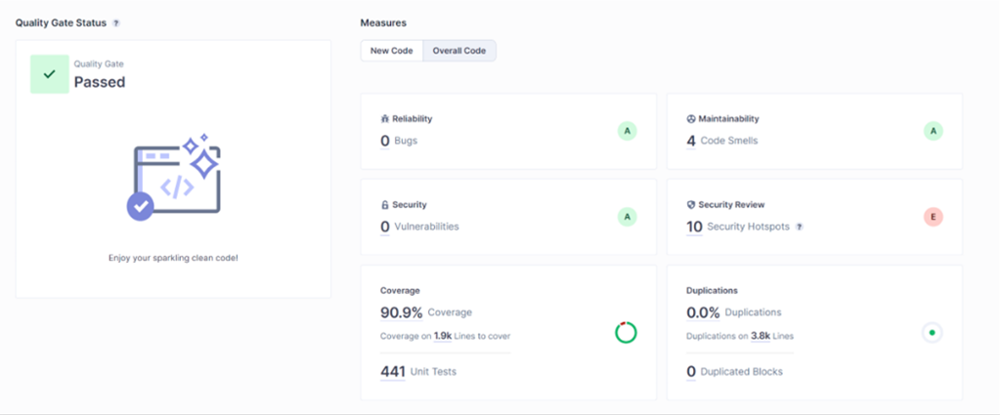
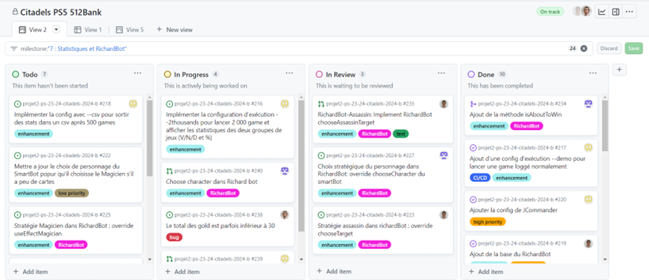
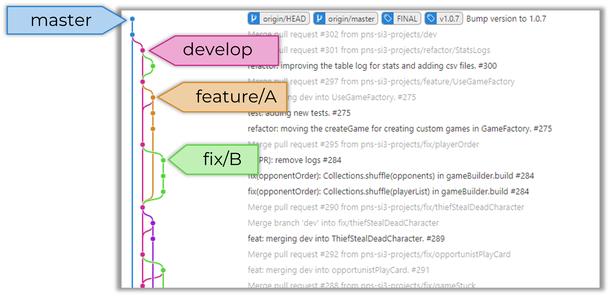

# Rapport projet PS5 Citadelles

## 1. Point d'avancement

### 1.1 Couverture du jeu
 
#### a. Fonctionnalités  ####
Pour ce projet, nous avons eu le temps d’implémenter la quasi-totalité des règles et fonctionnalités du jeu Citadelles. Nous pouvons lancer des parties de trois à six joueurs, chacun utilisant des stratégies différentes. De plus, nous nous assurons qu’à chaque moment de la partie, seules 65 cartes et 30 pièces sont disponibles. Nous avons également ajouté la variante de Citadelles qui autorise le roi, même s’il se fait assassiner à prendre la couronne pendant le tour où il est mort et à pouvoir choisir son rôle en premier lors du prochain round. Cette variante prend effet avec la commande : `mvn exec:java  - -variante ` .

Cependant, il reste quelques fonctionnalités que nous n’avons pas eues le temps d’implémenter. D’abord, nos parties ne supportent pas les règles particulières pour sept joueurs. De plus, nos bots ne sont pas aussi libres durant leur tour que des joueurs sont sensés l’être. En effet, ils sont obligés d’essayer d’utiliser l’effet de leur personnage durant leur tour. Enfin, l’ordre d’utilisation de leurs actions durant un tour est fixé (hormis le choix de piocher de l’or avant ou après avoir joué qui est implémenté pour quelques bots). Par exemple, l’utilisation de l’effet du personnage est toujours réalisée au début du tour du joueur.

#### b. Fonctionnalités semaine de sprint ####
Durant le dernier sprint que nous avons réalisé, trois nouvelles fonctionnalités ont été rajoutées dans les spécifications et nous avons pu les implémenter avec succès.

- **Configuration d'exécutions**
Nous avons ajouté deux options d’exécution (détectées grâce à la JCommander). 

D’une part, il est possible de rajouter l’argument --demo à la commande mvn exec:java. Ce paramètre lance une partie avec tous les logs activés, pour pouvoir observer son déroulement.

D’autre part, l’option --2thousands lance deux fois 1 000 parties. Le premier millier de parties permet de faire s’affronter notre meilleur bot (SmartBot) contre le deuxième meilleur (Richard Bot), dans une partie comprenant tous nos différents bots. Le deuxième millier voit s’affronter six clones de notre meilleur bot (SmartBot). Ainsi, à la fin de chaque millier de parties, des statistiques de la forme suivante sont affichées :
  

- **Statistiques en CSV**
Nous avons aussi ajouté la possibilité de sauvegarder les statistiques de parties jouées dans un fichier CSV stocké dans /ressources/stats/. Cette fonctionnalité s’active grâce à l’argument de commande --csv. Dans ce mode, 100 parties sont exécutées, sans aucun log. Les statistiques tirées de cette partie sont agrégées à celles déjà stockées et sauvegardées dans le fichier gamesstats.csv. Le contenu de ce fichier est affiché à la fin de la partie.

De plus, on peut combiner cet argument avec --2thousands dans la commande `mvn exec:java -Dexec.args=--2thousands --csv`. Cette configuration permet d’exécuter 2 milliers de parties (selon la description de l’option --2thousands) et de sauvegarder les statistiques de chaque millier de parties respectivement dans le fichier BestAgainstSecondAndOthers.csv et BestBotsAgainstBestBot.csv. Les nouvelles statistiques sont, ici aussi, agrégées à celles qui étaient déjà présentes dans les fichiers.

- **Le RichardBot**

Le bot utilisant la stratégie décrite par les utilisateurs du forum TricTrac Richard et tt-22a5e3f98e5243b9f1135d1caadc4cc7 a été implémenté le plus fidèlement possible. Ici, nous avons suivi au plus proche les conseils donnés par les 2 utilisateurs.

#### c. Logs ####

Concernant les logs, nous avons attribué une couleur à chaque joueur. De cette manière, la lecture de la partie est bien lisible. Les logs nous informent sur le début et la fin d'une partie, le début et la fin d'un round. Nous affichons également toutes les informations sur un joueur tel que sa main, sa citadelle, son nombre de pièces d'or avant et après son tour ainsi que l’effet de son personnage. Enfin, des logs affichant les stratégies existent, mais sont configuré à un niveau de log moins important que les autres pour qu’ils soient invisibles lors de l’exécution en mode démo.

#### d. Statistiques ####
Pour implémenter le stockage des statistiques, nous nous sommes basés sur la bibliothèque OpenCSV. Les informations sont stockées dans trois fichiers différents : gamestats.csv, BestBotsAgainstBestBot.csv, BestAgainstSecondAndOthers.csv. Nous avons donc un fichier pour les statistiques des 100 parties du mode --csv et un pour chaque millier de parties lancé en mode --2thousands.

Dans chaque fichier, nous sauvegardons pour chaque joueur : le nombre de parties qu’il a joué, le nombre de parties qu’il a gagné et perdu, son score moyen, son pourcentage de victoire et le nombre de fois qu’il a terminé à chaque position du classement. Le code prend en charge la lecture et la vérification des données CSV existantes, afin d'ajuster les nouvelles statistiques en fonction des résultats précédents en les agrégeant. Il crée également les fichiers CSV s'ils n'existent pas déjà.

#### e. Bots implémentés ####

- **SmartBot**
  Le SmartBot a pour stratégie de rusher en posant le plus de cartes possibles qui coûtent le moins cher possible en un minimum de temps.
- **RichardBot**
  Le RichardBot est celui que nous avons implémenté durant le dernier sprint en suivant les conseils du forum TricTrac. Il a pour stratégie de rusher et de poser le plus de cartes car il étend le SmartBot. De plus, il fait également attention au choix de son personnage en fonction de l'état de la partie. Si un joueur est sur le point de finir, il passe en mode agressif pour attaquer ce personnage et l’empêcher de finir. 
- **RandomBot**
  Le RandomBot effectue ses choix aléatoirement tout au long de la partie. Il choisira aléatoirement son personnage, les cartes qu’il joue et comment jouer les effets de son personnage.
- **CustomBot**
  Le CustomBot implémente le design pattern Stratégie. Il est créé avec différentes stratégies de sorte à pouvoir être personnalisé. Nous avons choisi d’implémenter des stratégies agressives pour chaque phase de jeu. Ainsi, nous utilisons notre CustomBot comme bot agressif qui va s'occuper d'attaquer les joueurs bien positionnés, mais n'accorde pas d'importante à son propre développement, car il étend le RandomBot.
- **BuilderBot**
  Le BuilderBot adopte une stratégie proactive en privilégiant le choix du roi s'il possède des quartiers de noblesse dans sa main. En l'absence de ces quartiers, il opte pour le marchand s'il détient un quartier de ce type, et s'il possède plus de deux cartes et plus de cinq pièces d'or, il préfère l'architecte. Dans le processus de choix des cartes, le BuilderBot donne la priorité aux quartiers de noblesse, puis aux quartiers de type marchand. Si aucune de ces options n'est disponible, il sélectionne la carte quartier la moins coûteuse. Cette approche vise à maximiser la construction de quartiers en adaptant ses choix en fonction des ressources disponibles.
- **OpportunistBot**
  L'Opportuniste privilégie les rôles moins agressifs et moins ciblés. Il choisit en priorité le voleur s'il en a l'occasion, sinon opte pour l'évêque s'il possède au moins un quartier religieux. En cas de disponibilité, il sélectionne le condottiere s'il a plus d'une pièce d'or. De plus, s'il détecte qu'un autre joueur a au moins 4 pièces d'or, il privilégie le voleur. En ce qui concerne le choix des quartiers, l'Opportuniste priorise les quartiers religieux, sinon opte pour le quartier le moins cher. En résumé, il va prioriser le vol des pièces d’or ou des cartes.

#### Comparaison des bots  ####

Pour comparer nos bots, nous avons lancé un grand nombre de parties et récupéré le tableau de statistiques ci-dessous.

D’après nos statistiques, basées sur 500 000 parties, nos deux bots les plus forts sont le RichardBot et le SmartBot. Notre bot le moins bon est le RandomBot. Ces statistiques peuvent donc se justifier par les stratégies que nous avons introduites aux deux bots les plus forts. Ils sont tous les deux basés sur le SmartBot qui vise à rusher jusqu’à la victoire en posant le plus de districts de coût le plus faible possible. 

La différence de pourcentage de victoire entre le SmartBot et le RichardBot est liée aux stratégies agressives du RichardBot. Il alors va abandonner son développement personnel si un des bots est sur le point de poser sa 8e carte. Les bots aléatoires jouent de manière aléatoire donc avec peu de chances de réussite. Le CustomBot implémente un design pattern Stratégie, il peut s’apparenter à un bot agressif, il ne pense pas à son développement personnel, mais plus à contrer les joueurs les plus avancé ce qui ne lui permet pas de gagner non plus. 

Enfin, nous pouvons voir qu’en faisant des parties uniquement avec notre meilleur bot, les moyennes de victoire sont toutes identiques ce qui est très cohérent étant donné qu’ils utilisent la même stratégie. 

## 2. Architecture et qualité 

### 2.1 Architecture et sa justification 

L’architecture de base que nous avons choisie se base sur le modèle MVC. Nous avons donc un package model qui stocke toutes les données et les comportements des joueurs, des cartes quartier, des personnages. Le package controller inclut les classes gérant le déroulement du programme. Enfin le package view stock les classes d’interfaces utilisateur. Nous avons donc une interface IView qui expose toutes les méthodes requises pour l’affichage et une classe Cli qui implémente cette interface en affichant dans la console via un logger. L’ajout d’une nouvelle interface graphique serait donc assez facile puisqu’il suffit d’ajouter une implémentation de IView.

Pour les personnages, une super-classe abstraite Character gère les données et comportements communs à tous les personnages. Cette classe est étendue par celles des personnages n’ayant pas de couleur et par la classe abstraite CommonCharacter. Celle-ci généralise le comportement de chaque personnage qui a une couleur attribuée : le roi, l’évêque, le marchand et le condottiere. Il existe donc une classe pour chacun de ces personnages qui étend CustomCharacter.

Pour les bots, nous avons une super-classe Player qui est étendue par tous nos différents bots. De cette manière, ajouter un bot ou même un joueur contrôlé par un utilisateur est simple puisque le comportement commun à tous les joueurs (piocher deux pièces d’or, construire un quartier) est implémenté dans Player. De plus l’un de nos bots, le CustomBot utilise le design pattern Stratégie. Ainsi, pour simplifier la création de ce CustomBot, nous avons utilisé le pattern Builder dans la classe CustomBotBuilder. 

Nous avons aussi utilisé ce dernier pattern et le pattern Factory pour créer nos parties dans les classes GameBuilder et GameFactory.

### 2.2  Informations importantes 

Les informations importantes concernant notre jeu ainsi que les instructions d’installation et d’utilisation se trouvent dans le README. Pour plus de détails techniques, notamment pour les développeurs, la javadoc est disponible dans le dossier /docs.

### 2.3 État de la base du code 

#### a. Parties bien optimisées ####

Premièrement, la solidité et la fiabilité de notre code sont des éléments sur lesquels nous avons pu compter sans réserve, une assurance renforcée par l'ensemble des analyses rigoureuses effectuées via SonarCube (capture d’écran de l’analyse ci-dessous). Ces analyses valident la qualité de notre travail et aussi soulignent notre engagement envers le respect des bonnes pratiques en Java.

De plus, la bonne organisation de notre équipe tout au long de ce projet a joué un rôle clé dans notre réussite. La gestion efficace du temps, la définition claire des étapes à travers la création de milestones et la gestion proactive des issues ont facilité une progression fluide et structurée. Cette organisation méticuleuse nous a permis de maintenir une vision claire de nos objectifs et d'adapter notre planification en conséquence pour répondre efficacement aux défis rencontrés.

Enfin, l'adoption d'un design pattern double dispatch entre les joueurs et les personnages représente une innovation majeure dans notre approche de la conception du jeu. En déléguant la décision concernant l'effet à utiliser à chaque personnage plutôt qu'au joueur, nous avons instauré un mécanisme plus logique et cohérent de gestion des responsabilités. Cette méthode a non seulement simplifié la logique de jeu, mais a également enrichi l'interaction entre les éléments du jeu, conduisant à une expérience de développement plus efficace.

#### b. Parties à refactor/améliorer ####

Nous avons malheureusement laissé quelques parties de code dupliqué, notamment des .stream(). En effet, nous avons implémenté chacun nos parcours de listes indépendamment alors qu’il serait intéressant de les généraliser dans des méthodes d’une classe outils. Nous nous sommes rendus compte de ce problème trop tardivement car ce code dupliqué n’est pas détecté par SonarCube.

Il aurait aussi été intéressant d’implémenter un arbitre dans notre solution. Celui-ci servirait d’intermédiaire entre chaque joueur, ses opposants et la partie. Nous avons tout de même implémenté une interface Opponent. Notre classe Player implémente Opponent afin d’exposer aux autres joueurs seulement une partie des méthodes et attributs d’un joueur.

## 3. Processus

### 3.1 Répartitions des tâches ###

Chaque membre de l’équipe a codé sur tous les aspects du projet (architecture, règles et déroulement du jeu, stratégies, bots, logs, JavaDoc, tests). De cette manière, nous nous sommes assurés que chacun ait une bonne compréhension et bonne vision d’ensemble du projet.

### 3.2 Organisation de l'équipe sur GitHub ###

Le pilier principal de notre organisation est l’utilisation de milestones. Nous en réalisions une par semaine. Elles nous permettaient d’inclure dans chacune d’elle des avancements réguliers sur chacun des aspects du jeu : rôles, bots, cartes merveilles, …

Dans chacune de nos milestones, des issues de fonctionnalités été créées au début de celle-ci. 

Cependant, nous nous laissions le droit de rajouter durant la réalisation de la milestone des issues concernant des bugs trouvés ou des fonctionnalités manquantes et urgentes. Nous nous assignions donc les tâches déjà créées au début de la milestone. Pour les réaliser, il fallait créer une branche pour chaque issue. Enfin, nous pouvions visualiser et gérer efficacement toutes nos issues de la milestone actuelle grâce au board GitHub ci-dessous.

Enfin concernant notre stratégie de branche, nous avons choisi Gitflow. Ainsi, nous avions une branche principale master qui était stable à tout moment et une branche de développement develop. Elles étaient toutes les 2 protégées et devait donc être alimentées via des pull requests (devant être validées par au moins un autre développeur) créées depuis nos branches de feature (utilisées pour ajouter des fonctionnalités) ou de fix (utilisées pour corriger des bugs). Un exemple de notre graphique à la fin de la milestone 7 est ci-dessous.

Pour nous assurer de la consistance de nos commits dans les branches de fix et de feature, nous avons ajouté un hook qui nous empêche de commit en cas d’oubli de la précision du numéro d’issue avec par exemple un #123.

Nous disposons également d'un pipeline opérationnel à chaque nouvelle pull request et à chaque push sur les branches dev et master. De plus, lors d'un merge dans la branche master, le pipeline générera automatiquement une release indiquant la version avec un fichier JAR associé. Le nom de la release sera la version du fichier pom.xml. Cette version est mise à jour après chaque push/merge dans master.
